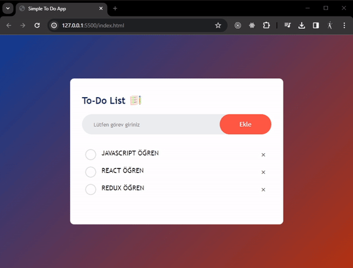

<h1>Simple To Do JS</h1>
<h3>Basit düzeyde TO-DO mantığı anlaşılabilmesi için hazırlanmış olan bu projede kaydetme silme özelliği bulunmakta.
Bunlara ek olarak local storage yapısı da kullanıldı.</h3>

